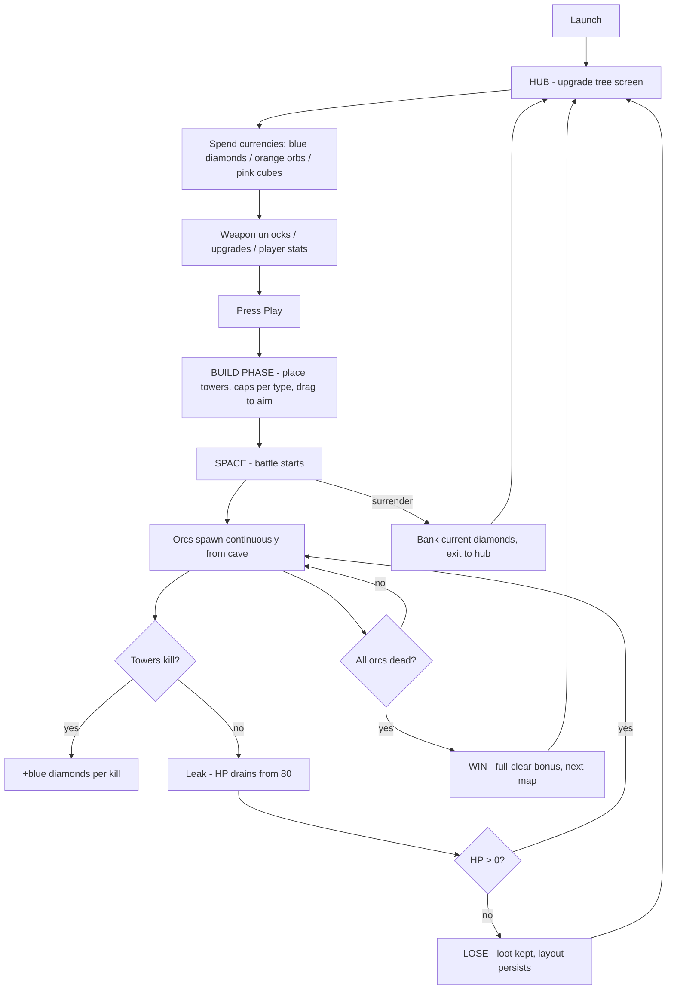
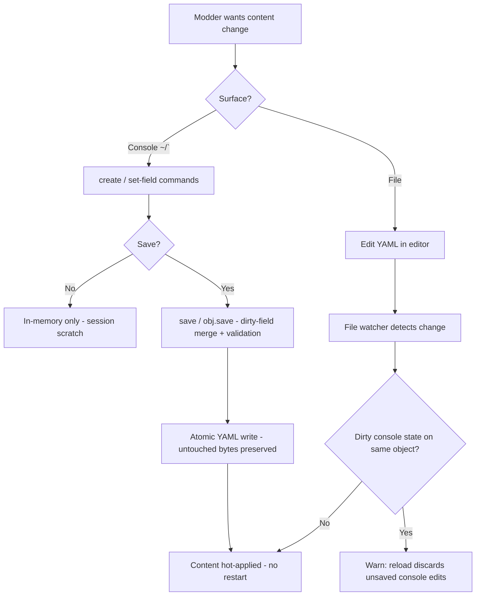
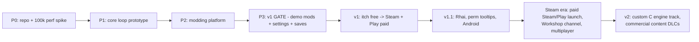

# MOONSHELL — Project Specification
*Open-source, moddable, horde-scale incremental tower defense*
*Status: LOCKED (Project Soul Interview, 2026-08-22/23) · Working title stylization: Moonshell · Studio/Org: Nanos Project*

---

## 1. Vision & Soul

**One line:** Moonshell is an open-source, highly-performant, YAML+script-moddable clone of *Sir, We Have an Orc Problem* — an AI defending its lunar defensive base against an overwhelming orc swarm.

**The soul:** a modding platform that ships a tower-defense game as its proof. The game is the demo; the platform is the product. Anyone can clone it, compile it, and ship their own variant by editing data files.

**Why:** learning by reading and playing with the code; FOSS ownership; deep customization; seeing how far horde-scale performance can be pushed.

**Success (XOR — any one counts):** a small Discord with real enthusiasm · people submitting issues/PRs · forks + stars.

**Non-negotiables:** open source · self-compilable · YAML data-driven content · scripting layer for novel behaviors · performance aspiration = surpass the original (target 100k entities @ 60fps, pending spike) · modding requires zero engine code.

---

## 2. Users & Market Fit

**Personas (priority order):**
1. **The Modder/Tinkerer** — creates content, wants zero-friction iteration. JTBD: "make my own variant without fighting the engine."
2. **The Learner** — wants to read and understand the whole stack.
3. **The Player** — horde-TD fans; courted after 1–2 via market research.

**Verified market research (2026-08-22):**
- Reference game: *Sir, We Have an Orc Problem* (Steam 4594150, Mumpitz Games, Godot engine, $9.99, released 2026-07-28). **Very Positive, 2,163 reviews, 87%.** Categories: single-player, achievements, save-anytime, no-timed-input, mouse-only option.
- **No Steam Workshop, no modding categories** (verified via Steam Store API).
- Its Nexus Mods page already has **3 mods two weeks post-launch**, including a loader and a mod menu — demand for modding this exact game is proven and active.
- Modding is *not* an empty space in horde TD (Workshop/Nexus exist for OMD2, They Are Billions, Dungeon Defenders, Mindustry, Riftbreaker, BTD6…), but **nothing is open source except Mindustry** (GPL-3.0, 28.7k★, factory-focused, Java mods), and **nothing offers content-as-data modding** — every existing scene requires a toolchain (MelonLoader, SDKs, C#/Java), not a YAML file.

**Market-fit statement (locked):** *"The only open-source, horde-scale incremental tower defense where modding is editing data files — no SDK, no compilation, no loader hacks — and the whole game is forkable and learnable."*

---

## 3. Core User Flows

**Player loop:**



**Modder loop (two equivalent surfaces, one content tree):**



**Edge cases locked:** quit mid-battle (explicit save boundary) · tower cap reached (block vs replace) · survive = win, kill-all = full-clear bonus · lose/surrender keeps loot + layout · crash-safe atomic writes everywhere.

---

## 4. Feature Scope (MoSCoW)

| Priority | Features |
|---|---|
| **Must (v1)** | Faithful clone loop (hub → build → battle → 3 currencies → HP 80 → continuous spawn → lose/win/surrender → layout persists) · modding platform (YAML content: races/units, weapons, maps, upgrade trees; hot-reload; console REPL with Tab-complete + save(); Lua scripting) · explicit save slots + auto-save · performance spike proven (100k @ 60fps) · **v1 gate: stranger's first mod (new race + 3 towers with upgrade trees) runs end-to-end as pure YAML + script, zero engine code** · MVP starter set: 5 towers, 3 maps, 1 race |
| **Should** | Settings (resolution, FPS cap/VSync, audio, keybinds, accessibility) · speed toggle · surrender-with-payout · pause/pan/zoom · UI clearly better than the original ("not appalling") · bundled demo mods: in-round upgrades, multi-round maps · deadpan AI voice + moon-base flavor |
| **Could** | Endless mode · challenge variants (no-turret, single-type) · 11 achievements · segregated modded "records" · in-game mod browser · Rhai scripting backend (v1.x) · clickable permission descriptions (v1.x) |
| **Won't (v1)** | Modded runs on competitive leaderboards · microtransactions · Workshop *dependency* (Workshop optional, added at Steam release) · fake sandbox security |
| **Post-v1 (Steam era)** | Multiplayer (scope TBD — co-op vs competitive, mod-synced sessions) · Steam Workshop as an *optional* mod distribution channel · commercial DLCs (content-based, closed data — see §7 legal note) |

---

## 5. Design & Experience

**Theme (locked):** cyberpunk, dark neon. The player is an **AI/nanobot commander**; towers are nanotech constructs; orcs are the organic infestation ("bio-signatures"). **v1 setting: a lunar defensive base** — the AI rings a crater dome with a nanite grid; maps are outpost sectors.

**Voice (locked):** deadpan AI narration. *"THREAT ASSESSMENT: 400 bio-signatures approaching. Deploying nanite grid."*

**Currencies (locked):** shape-coded, colorblind-safe — 💎 **Diamonds** (kills, accumulates per run) · 🟠 **Orbs** (unlock weapons) · 🟪 **Cubes** (weapon upgrades).

**Hub mockup:**

```
┌────────────────────────────────────────────────────────────────┐
│  💎 1,240    🟠 6    🟪 12      [Sector 1]   ⚙  [Mods] [Records]│
├────────────────────────────────────────────────────────────────┤
│  UPGRADE TREE                    ┌──────────────┐               │
│  ○──●──●──○──●                  │  NEXT: 1.2   │               │
│  │     ╲──○──●──○                │  Orcs: 1,200 │               │
│  ●──○──●─────●──○                │  Rounds: 3   │               │
│  │        │     │                │  Routes: 2   │               │
│  ○──●──○──●──○──●                │  [▶ Play]    │               │
│  (tooltip: Cannon II - +25% dmg) └──────────────┘               │
└────────────────────────────────────────────────────────────────┘
```

**Battle HUD mockup:** top bar (3 currencies · HP 80/80 · orc count · kills · leaks) · round/pace controls (⏸ ▸ ⏩) · active ability slot · tower slots with caps (e.g. Vulcan 5/6) · SURRENDER · SPACE hint.

**Accessibility:** no timed input · pace control · shape+color coding · remappable keys · save anytime.

---

## 6. Technical Architecture

| Component | Decision (verified) |
|---|---|
| Engine | Rust + **Bevy 0.19.1** (ECS — 100k entities native territory) |
| Content model | **yaml-edit 0.2.3** — lossless round-trip tree = in-memory object graph; console + file are two surfaces over ONE tree |
| Scripting | **Lua 5.4 via mlua 0.12** (memory limits) — Rhai as v1.x optional backend behind a small trait |
| Hot-reload | notify 8.2 file watcher |
| Typed state | serde 1.0 |
| Rendering | Bevy 2D; sprite batching/instancing if the spike demands it |
| Save | explicit slots + auto-save; atomic writes (temp + rename) |
| Mods | directories/zips; manifest with `permissions:` |
| Platforms | Linux + Windows (v1) · Android (v1.x) · WASM open via Bevy |

**Mod sandbox (B+):** restricted `_ENV` (whitelist, no io/os/debug/package) · `set_memory_limit` (enforced) · instruction-count hook (runaway loops) · permission manifest approved at install · warn-on-install · containment, not isolation — documented honestly.

**v2:** custom C engine (SDL2 + OpenGL) as the learning track — "we cloned the game, then we cloned the engine."

**First engineering task:** the 100k-entity performance spike before any game code.

---

## 7. Non-Functional & Operational

- **Performance:** 100k entities @ 60fps on mid hardware — proven or revised by the spike.
- **Reliability:** atomic saves/mod writes; explicit save slots; crash-safe.
- **Observability:** log file; mod errors surfaced in the console with file/line.
- **Deployment:** GitHub (source + CI binaries) · itch.io (free) · Steam + Google Play (paid). Free GitHub/itch, paid stores — Mindustry model.
- **Cost model:** Steam $100/app, Play $25, itch $0, CI free — recurring ≈ $0. Price **$4.99** (undercut the $9.99 original).
- **Legal:** **GPL-3.0** (Mindustry precedent — selling allowed, forks must stay open) · mechanics-only cloning; own title, own art, own name.
- **DLC licensing (planned):** content-based DLCs (YAML/SVG/Lua data) are legally clean under GPL — GPL covers the engine; data/assets can be proprietary. Code-level closed DLC would require engine dual-licensing (GPL + commercial) — deferred, only if ever needed.

---

## 8. Roadmap & Validation



**Validation (cheap):** modding demand already proven (3 Nexus mods in 2 weeks) · publish mod-format docs + one sample mod at P2 · itch free beta at P3 · success XOR as the gate.

---

## 9. Open Items (small, non-blocking)

1. Exact sources of Orbs/Cubes (observed: Diamonds = kills; pending in-play confirmation).
2. End-of-run screen copy (win/lose/surrender wording).
3. Title stylization: **Moonshell** (default) vs MoonShell.
4. Repo creation + first commit (P0) — pending "go".
5. Price final sign-off at $4.99.
6. Multiplayer scope (co-op vs competitive; mod-synced vs vanilla sessions) — decide at Steam-era planning.
7. Confirm "Workplace" in user roadmap = Steam Workshop (assumed).

---

*Generated by the Project Soul Interviewer · all decisions locked in-session and mirrored to the continual harness.*
